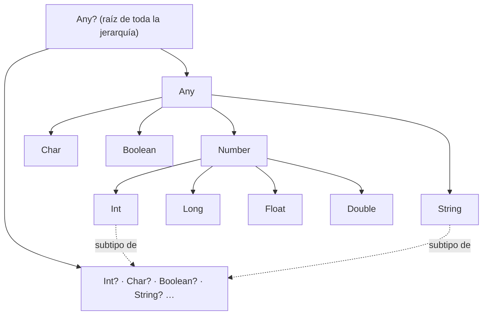

# 2 · Jerarquía de tipos en Kotlin

> [!info] Asignatura
> [[DAM/Programacion_Multimedia_y_Dispositivos_Moviles/Indice|Programación Multimedia y Dispositivos Móviles]] · Tema 2 · Kotlin
> Fuente original: `Documentos/Notas/Jerarquía de tipos.md`

## Índice del tema

- [[#1. Tipos básicos]]
- [[#2. Tipos numéricos]]
- [[#3. Caracteres]]
- [[#4. Rangos y progresiones]]
- [[#5. Booleanos]]
- [[#6. Strings]]
- [[#7. Tipo vs. clase]]
- [[#8. Tipos nullables]]
- [[#9. Los tipos Any y Any?]]
- [[#10. Arrays]]
- [[#11. Comprobación de tipo]]

---

## 1. Tipos básicos

Kotlin **no distingue entre tipos primitivos y tipos referenciales**: todos los tipos son referenciales, es decir, trata a todos los valores como objetos de una determinada clase.

```kotlin
// Se declara una variable i que referencia (apunta)
// a un objeto de la clase Int correspondiente al valor 1.
val i: Int = 1
// Como Int es una clase, no un tipo primitivo, se puede
// usar con genéricos, como por ejemplo en las colecciones.
val list: List<Int> = listOf(1, 2, 3)
```

- **Literales**: notaciones preconstruidas que se usan para crear instancias de los tipos correspondientes.

Representar todos los valores como objetos es más cómodo, pero **menos eficiente** (sobrecarga de crear objetos). Para solventarlo, en tiempo de compilación Kotlin genera automáticamente el código de conversión entre el objeto (p. ej. `Int`) y el tipo primitivo de la JVM (`int`) y viceversa: son el **boxing** y **unboxing**, transparentes para el desarrollador.

> [!note] Cuándo NO es posible la conversión automática
> - Cuando el tipo se usa como **argumento de genéricos** (colecciones): se usa el tipo *boxed* de la JVM, p. ej. `Integer`.
> - En **tipos nullables** como `Int?`: el `null` sólo cabe en una referencia, así que se compila con el tipo *boxed* (`Integer`).

---

## 2. Tipos numéricos

Todos los tipos numéricos son subtipo del tipo representado por la clase abstracta `Number`:

| Tipo | Tamaño (bits) | Tamaño (bytes) | Codificación | Rango de valores |
| --- | --- | --- | --- | --- |
| `Byte` | 8 | 1 | Complemento a 2 | −128 a 127 |
| `Short` | 16 | 2 | Complemento a 2 | −32.768 a 32.767 |
| `Int` | 32 | 4 | Complemento a 2 | −2.147.483.648 a 2.147.483.647 |
| `Long` | 64 | 8 | Complemento a 2 | −9,2·10¹⁸ a 9,2·10¹⁸ |
| `Float` | 32 | 4 | IEEE 754 precisión simple | 6–7 dígitos decimales |
| `Double` | 64 | 8 | IEEE 754 precisión doble | 15–16 dígitos decimales |

Diferencias respecto a Java:

1. **No hay conversiones implícitas** de número (p. ej. `Int` → `Long`): los tipos más pequeños no son subtipos de los más grandes.
2. Los **caracteres no son números**.
3. Algunos literales difieren: **no se permite el octal**.
4. Desde Java 7, `_` como separador de cifras: `1_000_000`.

**Literales numéricos**:

| Grupo | Ejemplos |
| --- | --- |
| Enteros | `123`, `123L` (Long), `1_000_000`, `1234_5678_9012_3456L` |
| Reales | `123.5`, `123.5e10`, `123.5f` / `123.5F` (Float) |

- No hay sufijo para `Byte`/`Short`: si se especifica el tipo en la declaración, el literal se toma de ese tipo → `val s: Short = 345`.
- En la inferencia, si el valor cabe en `Int` se infiere `Int`; si es mayor, `Long` → `val num = 12345678912345` es `Long`.

**Conversiones explícitas** — `Number` incluye métodos abstractos, así que todos los tipos numéricos tienen: `toByte()`, `toShort()`, `toInt()`, `toLong()`, `toFloat()`, `toDouble()`, `toChar()`.

**Operadores**:

| Familia | Operadores |
| --- | --- |
| Aritméticos | `+`  `-`  `*`  `/` (entera si ambos operandos son enteros)  `%`  `++`  `--` |
| Asignación | `=`  `+=`  `-=`  `*=`  `/=`  `%=` |
| Relacionales | `==`  `!=`  `<`  `>`  `<=`  `>=` |
| Rango | `x in a..b`  ·  `x !in a..b` |

Los operadores aritméticos están **sobrecargados** para retornar el resultado en el tipo adecuado, realizando internamente las conversiones apropiadas:

```kotlin
// Long + Int => Long
val x1 = 1L + 3
// Equivalente. El método plus de la clase Long está sobrecargado
// con una versión para cada tipo numérico de parámetro, en este caso Int.
val x2 = 1L.plus(3)
```

```kotlin
val valor: Int = 5
val between1and10 = valor in 1..10       // true
val notBetween10and20 = valor !in 10..20 // true
```

### Precisión ilimitada: BigDecimal y BigInteger

Los tipos básicos tienen tamaño y precisión limitados. En la JVM, para tamaño ilimitado sin decimales se usa `BigInteger`, y para precisión/tamaño ilimitados con decimales, `BigDecimal`. Se crean con constructores, funciones factoría (`BigInteger.valueOf()`) o conversión desde tipos básicos (`toBigDecimal()`, `toBigInteger()`), y admiten los operadores `+`, `-`, `*`, `/`.

---

## 3. Caracteres

- Tipo `Char`; literales entre **comillas simples**: `'A'`, `'a'`.
- A diferencia de Java, **NO pueden tratarse como números** → `c == 65` es error de compilación.

```kotlin
val c: Char = 'A'
// ERROR DE COMPILACIÓN: tipo Char incompatible con Int
if (c == 65) {
    // ...
}
```

- Ocupa **2 bytes (16 bits)**: codificación **UTF-16** (igual que Java). Caracteros que la requieren (emojis complejos, ciertos caracteres asiáticos) usan dos `Char`: **par sustituto** (*surrogate pair*, 4 bytes).
- Propiedad `code`: valor Unicode como `Int` → `'A'.code == 65`.
- Escape: `'\t'`, `'\b'`, `'\n'`, `'\r'`, `'\''`, `'\"'`, `'\\'`, `'\$'` y unicode `'\uFF00'`.

---

## 4. Rangos y progresiones

Kotlin proporciona **tipos rango**: intervalos entre dos valores. `IntRange`, `LongRange`, `CharRange` y, desde Kotlin 1.5, los de enteros sin signo `UIntRange`, `ULongRange`, etc.

| Tipo de rango | Qué incluye | Interfaz | Literales |
| --- | --- | --- | --- |
| Cerrado | ambos límites | `ClosedRange<T>` | `a..b` |
| Con límite derecho abierto | sin el extremo derecho | `OpenEndRange<T>` | `a..<b` (desde Kotlin 1.8) |

- `a..b` es abreviatura de `a.rangeTo(b)`; la clase resultante depende del tipo (`IntRange`, `CharRange`…).
- Estas clases de rango **heredan de las progresiones** (`IntProgression`, `LongProgression`, `CharProgression…`). Las progresiones son **iterables** y tienen un **step** (paso, por defecto 1) que define el incremento entre elementos.
- `Float`/`Double` no tienen clase de rango dedicada: se crean con `ClosedFloatingPointRange`, basada en *step*. Conviene fijar siempre el paso y tener cuidado con el redondeo.

| Expresión | Equivalente | Valores |
| --- | --- | --- |
| `1..3` | `1.rangeTo(3)` | 1, 2, 3 |
| `1..<3` | `1.rangeUntil(3)` | 1, 2 |
| `3 downTo 1` | `3.downTo(1)` | 3, 2, 1 |
| `1..3 step 2` | `(1..3).step(2)` | 1, 3 |
| `4 downTo 0 step 2` | `(4.downTo(0)).step(2)` | 4, 2, 0 |
| `1 until 3` | `1.until(3)` | 1, 2 (sólo rangos incrementales) |
| `1.0..2.0 step 0.5` | `(1.0..2.0).step(0.5)` | 1.0, 1.5, 2.0 |

`x in progresion` llama internamente a `contains()` de la progresión.

```kotlin
for (value in 4 downTo 0 step 2) {
    println(value)   // 4, 2, 0
}
```

---

## 5. Booleanos

- Tipo `Boolean`: `true` / `false`.
- Operadores lógicos `||`, `&&`, `!` **con cortocircuito**: la segunda expresión sólo se evalúa si es necesario.

```kotlin
fun main() {
    val result = false && calculate()   // calculate() NO se ejecuta
    println("result vale " + result)
}

fun calculate(): Boolean {
    println("Estoy calculando")
    return true
}
```

- Como en Java pero **no** como en C/C++: `0` no es `false` ni un valor != 0 es `true`; mezclar booleano con entero es error de compilación.

```kotlin
val condition = 1
// ERROR DE COMPILACIÓN: type mismatch
if (condition) {
    println("condition es true")
}
```

- Métodos infix `and(other)` y `or(other)`: se usan como operadores binarios (`a and b`), pero **NO usan cortocircuito** — `b` se evalúa siempre.

```kotlin
fun main() {
    val result = false and calculate()  // calculate() SÍ se ejecuta
    println("result vale " + result)
}

fun calculate(): Boolean {
    println("Estoy calculando")
    return true
}
```

---

## 6. Strings

- Tipo `String`, **inmutable**: al "modificarla" se retorna un nuevo objeto.
- Internamente en la JVM es una instancia de `java.lang.String` (interoperabilidad total).
- Indexable como secuencia de `Char`: `s[i]`, incluso con `for` de tipo *for each*.

```kotlin
val str = "abcd"
for (c in str) {
    println(c)
}
```

**Comparación**: en Kotlin `==` es seguro con cadenas; el compilador traduce `a == b` por `a?.equals(b) ?: (b === null)`.

```kotlin
val str1 = "Baldomero"
val str2 = "Baldomero"
val iguales1 = str1 == str2
val iguales2 = str1?.equals(str2) ?: (str2 === null) // equivalente
```

**Concatenación**: el operador `+` funciona con otros tipos **sólo si el primer operando es String** (internamente `plus()`).

```kotlin
val s1 = "abc" + 1        // "abc1" — OK, primer operando es String
val s2 = "abc".plus(1)    // equivalente
// ERROR DE COMPILACIÓN: plus de Int no recibe un String
val s3 = 1 + "abc"
```

**Multilínea**: delimitadas por `"""`, sin escapes, admiten saltos de línea. `trimMargin()` elimina los espacios iniciales de cada línea (prefijo de margen por defecto `|`; se puede cambiar: `trimMargin(">")`).

```kotlin
val text = """
    |Tell me and I forget.
    |Teach me and I remember.
    |Involve me and I learn.
    |(Benjamin Franklin)
    """.trimMargin()
```

**Plantillas de cadena** (no existen en Java):

| Formato | Ejemplo | Salida |
| --- | --- | --- |
| `$variable` | `println("i vale $i")` | `i vale 10` |
| `${expresión}` | `println("$s.length is ${s.length}")` | `abc.length is 3` |
| `$` escapado en unilínea | `"\$$onSales"` | `$9.99` |
| `$` en multilínea (sin escapes) | `${'$'}$onSales` | `$9.99` |
| Interpolación `$$` (Kotlin 2.2.0+) | `$$"$$$normalPrice"` | `$29.99` |

Con `$$` anteponiéndose a la cadena, el `$` es un carácter normal y hay que escribir `$$` para interpolar:

```kotlin
val priceDescription = $$"""
    |Rebajas: $$$onSales
    |Habitual: $$$normalPrice
    |Ahorro: $$${normalPrice - onSales}
    """.trimMargin()
```

> [!note] Cómo se compilan las plantillas
> - Partes todas conocidas en compilación → **cadena literal única** (aprovecha el *string pool*).
> - Con variables/expresiones de ejecución → se construye con **`StringBuilder`**, mucho más eficiente que concatenar con `+`.

---

## 7. Tipo vs. clase

Conceptos distintos que suelen confundirse:

- Un **tipo** es un *contrato sobre el comportamiento de los datos*: indica qué métodos/propiedades pueden usarse sobre un objeto, qué valores se pueden asignar a una variable o pasar como argumento. Es la ayuda del compilador (errores, sugerencias del IDE, optimización, selección de sobrecargas).
- Lenguajes sin tipos obligatorios (JavaScript, Python) son de **tipado dinámico**: el tipo se determina en ejecución y se pierde esa seguridad.

Relaciones:

- Definir una clase da lugar **al menos** a un tipo… y a veces a más: `Box<T>` genera infinitos tipos (`Box<Int>`, `Box<String>`, …); una clase `User` en Kotlin crea **dos** tipos: `User` y `User?`.
- Las interfaces también dan lugar a tipos sin ser clases.
- Subtipo ≠ herencia: si `ClaseHija` hereda de `ClasePadre`, su tipo es subtipo; pero una clase que **implementa** una interfaz también es subtipo de su tipo sin haber herencia.
- **Principio de sustitución de Liskov** (la L de SOLID): si `A` es subtipo de `B`, puede usarse `A` wherever se espere `B`.
- `User` es subtipo de `User?` (todo `User` vale donde se requiere un `User?`).
- Con genéricos se complica: ¿es `Box<Dog>` subtipo de `Box<Animal>`? → se ve en el tema de Genéricos.

---

## 8. Tipos nullables

El `NullPointerException` es el error clásico de Java. Kotlin lo trata detectándolo **en tiempo de compilación**: la nulabilidad forma parte del sistema de tipos.

> [!warning] Aviso
> En Kotlin aún es posible que se produzca una `NullPointerException`, aunque es mucho menos probable que en Java.

| Definición | ¿Admite null? | Ejemplo |
| --- | --- | --- |
| Tipo no nullable | No | `var a: String = "abc"` |
| Tipo nullable (`?`) | Sí | `var b: String? = "abc"` |

```kotlin
var a: String = "abc"
// ERROR DE COMPILACIÓN: tipo no compatible con el valor null
a = null
```

```kotlin
var b: String? = "abc"
b = null   // correcto: String? es compatible con null
```

- Las variables nullables **no se inicializan implícitamente a null**: hay que asignarlo explícitamente.
- Definida una variable como nullable, el compilador **restringe**:
  1. No se puede llamar directamente a métodos/propiedades sobre ella.
  2. No se puede asignar a una variable de tipo no nullable.
  3. No se puede pasar a una función que espere un parámetro no nullable.

```kotlin
var a: String = "abc"
var b: String? = "abc"
val aLength = a.length   // permitido: a es non-nullable
// ERROR DE COMPILACIÓN: acceso no seguro sobre nullable
val bLength = b.length
// ERROR DE COMPILACIÓN: tipos incompatibles
a = b
```

> [!tip] Sugerencia
> Usa tipos no nullables siempre que puedas: pregúntate si de verdad una variable necesita poder valer null.

---

## 9. Los tipos Any y Any?

| Tipo | Papel | Equivalente Java |
| --- | --- | --- |
| `Any` | Supertipo de todos los tipos **no nullables** (`Int`, `String`, …) | `Object`, pero no idéntico: faltan `wait()` y `notify()` |
| `Any?` | Raíz de la jerarquía de tipos **nullables** y **supertipo de `Any`** → raíz de TODA la jerarquía | — |

- `Any` define `toString()`, `equals()` y `hashCode()`, heredables/sobrescribibles.
- Asignar un literal primitivo a una variable `Any` produce **boxing** automático.

Cada tipo básico no nullable es **subtipo** del nullable correspondiente (`String` <: `String?`): por eso un `String` cabe en una variable `String?` y no al revés. Las comprobaciones de seguridad con null no son reglas especiales, son **reglas de tipos**. Ojo: subtipo no es herencia — que `String` sea subtipo de `Any` y de `String?` no implica herencia múltiple.



Dos ramas paralelas (no nullables / nullables); cada tipo no nullable es además subtipo de su nullable correspondiente.

**Consecuencia con genéricos**: al declarar `<T>`, `T` equivale por defecto a `Any?` → puede contener nulos:

```kotlin
fun <T> listOf(vararg items: T): List<T> {
    // ...
}
```

Para restringir `T` a tipos no nulos se exige que extienda de `Any`:

```kotlin
// Al hacer que T extienda de Any hacemos que sólo podamos
// pasar a la función tipos no nullables.
fun <T : Any> Iterable<T?>.filterNonNull(): List<T> {
    // ...
}
```

---

## 10. Arrays

A diferencia de Java, en Kotlin los arrays son una **clase parametrizada**: `Array<T>`.

**Creación**:

```kotlin
// Función factoría arrayOf(): Array<Int> con [1, 2, 3]
val myArray = arrayOf(1, 2, 3)

// Constructor: tamaño + lambda de inicialización (recibe el índice).
// El tipo del array es el tipo de retorno de la lambda.
// Array<String> ["V(0)", "V(1)", "V(4)", "V(9)", "V(16)"]
val squares = Array(5) { i -> "V(${i * i})" }

// Valores null: arrayOfNulls()
val nulls: Array<Int?> = arrayOfNulls<Int>(3)   // [null, null, null]
```

> [!note] Ten en cuenta
> Kotlin permite crear funciones fuera de cualquier clase, por eso `arrayOf()` no es un método estático de ninguna clase de utilidad.

- Un array **no puede cambiar de tamaño** durante su vida (como en Java).
- **Copia**: `array.copyOf(newSize)`. Si el nuevo tamaño es menor, se copian los que caben desde el principio; si es mayor, los restantes se rellenan → el tipo de retorno es nullable. Desde Kotlin 2.2 hay versión con lambda para inicializar los elementos restantes:

```kotlin
fun main() {
    val array = arrayOf("apples", "oranges", "limes")
    val arrayCopy = array.copyOf()
    println(arrayCopy.contentToString()) // [apples, oranges, limes]
}
```

```kotlin
fun main() {
    val array = arrayOf("foo", "bar", "baz")
    val truncatedCopy = array.copyOf(2)
    println(truncatedCopy.contentToString())            // [foo, bar]
    val paddedCopy = array.copyOf(5) { i -> "item $i" } // lambda (Kotlin 2.2+)
    println(paddedCopy.contentToString())               // [foo, bar, baz, item 3, item 4]
}
```

> [!note] Los arrays son invariantes
> Un `Array<Dog>` NO es subtipo de `Array<Animal>` aunque `Dog` sea subtipo de `Animal` (a diferencia de Java).

- Acceso: métodos `get()`/`set()` que normalmente se usan vía operador `[]` sobrecargado; propiedad `size`.

**Arrays de tipos primitivos**: `Array<T>` con `T` primitivo no permite usar el primitivo de la JVM internamente. Para eso existen clases específicas **sin relación de herencia con `Array<T>`** (mismos métodos y propiedades): `ByteArray`, `ShortArray`, `IntArray`, … con sus funciones factoría `intArrayOf()`, `byteArrayOf()`…

```kotlin
val myArray: IntArray = intArrayOf(1, 3, 5)
```

> [!tip] Sugerencia
> Si el tipo del array es uno de los primitivos, usa siempre la clase específica (`IntArray` en vez de `Array<Int>`): evitas la sobrecarga del *boxed type* y las conversiones.

- También existe `copyOf()` en estas clases, y **funciones de extensión de conversión** explícita, p. ej. `toIntArray()` sobre `Array<Int>` para obtener un `IntArray` de primitivos.

---

## 11. Comprobación de tipo

Los operadores **`is`** / **`!is`** comprueban si un objeto es de un determinado tipo (o subtipo). `is` devuelve `true`/`false`.

```kotlin
fun main() {
    val obj: Any = "Hola"
    if (obj is String) {
        println("obj is a string")
    }
}
```

- Se usan comúnmente en `if` y `when` (se verán con detalle en estructuras de control).
- Ventaja frente a `instanceof` de Java: como todos los tipos son referenciales, `is` funciona con **cualquier tipo**, incluso los "primitivos", donde `instanceof` no puede usarse.

---

## Esquema

- Todos los tipos son objetos (referenciales); boxing/unboxing automático salvo genéricos y nullables.
- Numéricos: `Byte/Short/Int/Long/Float/Double` < `Number`; sin conversiones implícitas → `toXxx()`; literales con sufijos `L/f` y separador `_`; `BigInteger`/`BigDecimal` para precisión ilimitada.
- `Char` UTF-16, no es número (`.code`); `Boolean` cortocircuitado (`&&`/`||`) vs `and`/`or` sin cortocircuito; booleanos ≠ enteros.
- Rangos `..`, `..<`, progresiones `downTo`, `step`, `until`, `in`.
- `String` inmutable, `==` seguro, multilínea `"""` + `trimMargin()`, plantillas `$var`, `${expr}`, `\$`, `'$'`, `$$` (2.2+).
- Tipo ≠ clase: contrato del compilador; Liskov; una clase genera dos tipos (`T`, `T?`).
- Nullables: nulabilidad en el sistema de tipos (compilación), `?`, restricciones de uso, preferir no-nullable.
- `Any` (raíz no nullable) y `Any?` (raíz absoluta, supertipo de `Any`); genéricos `T` ≡ `T : Any?` por defecto.
- `Array<T>` invariante; `arrayOf`, `Array(size){…}`, `arrayOfNulls`, `copyOf`; clases primitivas `IntArray`… y `toXxxArray()`.
- `is`/`!is` para comprobación de tipo (más potentes que `instanceof`).

## Relaciones

- [[01 - Introduccion a Kotlin]] — tema anterior: variables, inferencia de tipos
- [[01.1 - Ejercicios 1 Introduccion a Kotlin]] — incluye ejercicios de este tema
- [[03 - Funciones]] ✅ siguiente tema: `Unit`, `Nothing` en el sistema de tipos
- [[05 - Operaciones con tipos nullables]] — `?.`, `!!`, `?:` (resuelve las restricciones del apartado 8)
- [[09 - Genéricos]] — variancia: por qué `Array<Dog>` no es `Array<Animal>`

## Para repasar

- [ ] Explicar por qué Kotlin hace boxing automático y en qué casos NO puede
- [ ] Tabla de tipos numéricos: tamaños y rangos; conversiones `toXxx()`
- [ ] Diferencias de literales y de `char` respecto a Java
- [ ] `&&` vs `and`, `||` vs `or` (cortocircuito)
- [ ] Las 4 formas de escribir `$` dentro de una plantilla de cadena
- [ ] Diferencia tipo/clase y relación con el principio de sustitución de Liskov
- [ ] Por qué `String` es subtipo de `String?` y qué implicaciones tiene con null
- [ ] `Any` vs `Any?`; por qué `T` admite null por defecto
- [ ] Crear arrays con `arrayOf`, lambda, `arrayOfNulls`, `copyOf` (y con lambda)
- [ ] Cuándo usar `IntArray` en lugar de `Array<Int>`
